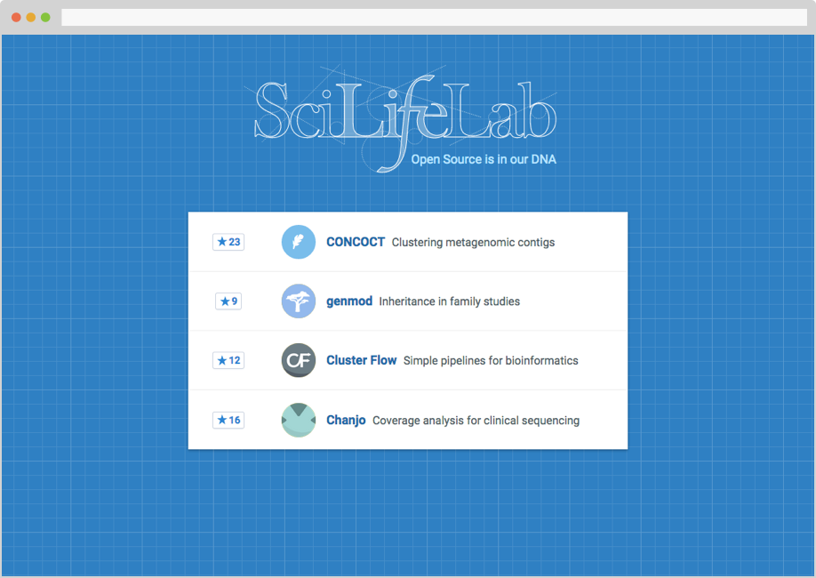

# opensource.scilifelab.se 

[Web portal][url] for open source (research) projects at [SciLifeLab](http://www.scilifelab.se/). The site will feature complete, ready-for-use software along with proper documentation and installation instructions.

SciLifeLab employee? Submit a pull request if you have a project that belongs on the list.

  

## Contributing
Big thanks to all the contributors who have added their projects to the site.

Everyone at SciLifeLab is invited to contribute. Read the [contributing instructions][contributing], then get started.

[contributing]: CONTRIBUTING.md
[url]: http://opensource.scilifelab.se/
